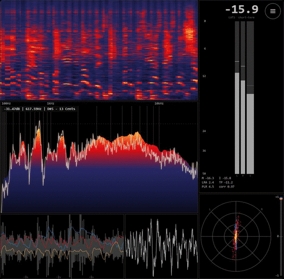

# MiniMeters Visualizer (Spicetify extension)

Broadcast-grade audio meters drawn inside Spotify in the style of the MiniMeters
*Analysis Master* preset: spectrogram, spectrum, waveform, oscilloscope, stereometer and
EBU R128 loudness (M / S / I, LRA, true peak, PLR, correlation).

The numbers are **real** — they come from the actual output signal, not Spotify's precomputed
analysis. A −20 dBFS tone reads −20.00 LUFS / −19.99 dBTP.

## How to use

1. Install this extension from the **Spicetify Marketplace** (or enable `minimeters.js`).
2. Click the **MiniMeters** button (the bars icon) in the now-playing bar to open the
   full-screen meters. Press **Esc** or **Close** to exit.

## Requires the bridge (one-time setup)

A Spicetify extension is sandboxed JavaScript inside Spotify — it **cannot capture system
audio by itself**. The measurements are produced by a tiny local companion,
**minimeters-bridge**, which captures the Windows output via WASAPI loopback and streams them
on `ws://127.0.0.1:8985`.

Install it once (Windows, no admin needed):

1. Get the bridge from the [latest release](https://github.com/Manuel-1312/minimeters-bridge/releases/latest)
   (or **Code → Download ZIP**), extract it.
2. Double-click **`Install MiniMeters Bridge.bat`**.

Until the bridge is running the overlay shows *bridge offline*. Once it is running, open the
MiniMeters overlay and the meters come alive. Full details in the
[project README](https://github.com/Manuel-1312/minimeters-bridge#readme).

## Credit
The metering visuals are a port of the `MiniMeters` renderer written for
[Konsl's spicetify-visualizer](https://github.com/Konsl/spicetify-visualizer) (MIT).

## License
MIT.
